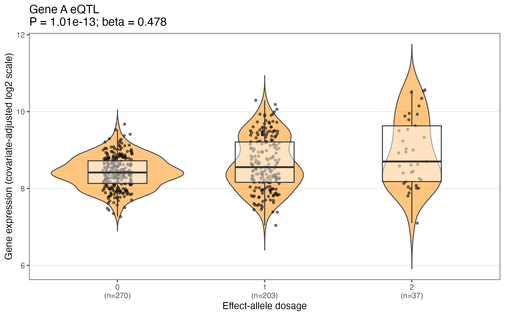
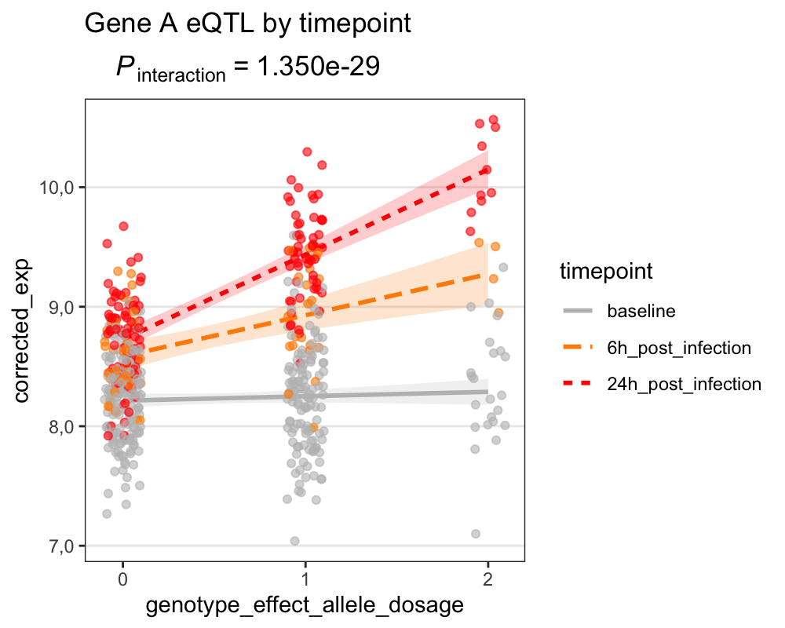

# Teaching note: a simulated eQTL analysis with repeated samples

This note is based on the files in `COI_summer.teaching/`:

- `Simulated_test_data_geneA_eQTL.csv`
- `Simulated test dataset_geneA_eQTL.R`

The workshop document describes a practical on eQTLs, genotype coding, linear mixed-effects models, and genotype-by-time analysis. The CSV and R script are simulated teaching data, not a genome-wide eQTL mapping.

## Data structure summary

The dataset is in **long format**: each row is one sample from one individual at one time point. There are 510 sample rows and 300 unique individuals (`subject_id`), so the rows are not all independent observations.

| Feature | Observed in the files |
| --- | ---: |
| Individuals | 300 |
| Samples/rows | 510 |
| Baseline samples | 300 |
| 6-hour post-infection samples | 62 |
| 24-hour post-infection samples | 148 |
| Individuals with baseline only | 152 |
| Individuals with baseline + 24 hours | 86 |
| Individuals with all three time points | 62 |
| Genotype groups (0, 1, 2 effect-allele copies) | 270, 203, 37 samples |
| Sex | F: 246; M: 264 |
| Batch | Batch1: 211; Batch2: 168; Batch3: 131 |

Available columns are `subject_id`, `sample_id`, `genotype_effect_allele_dosage`, `age_years`, `sex`, `batch`, `timepoint`, `hours_post_infection`, `infection_context`, and `geneA_expression_log2`.

The outcome appears to be log2 Gene A expression. Predictors include genotype dosage, age, sex, batch, and infection time/context. Genotype is constant within an individual, while expression and time vary by sample. This is a longitudinal/repeated-measures dataset with incomplete follow-up: all 300 individuals have baseline, but only 62 have all three time points.

## Why use an LMM here?

A simple linear model treats every row as if it came from a different, unrelated individual. That is not true here: some people contribute measurements at several time points. Samples from one person tend to be more alike because they share biology, genetics, and other unmeasured characteristics.

The script uses models such as:

```r
lmer(expression ~ genotype + age + sex + batch + (1 | subject_id), data = df)
```

The fixed effects estimate average relationships across the sample. The random intercept `(1 | subject_id)` allows each individual to have their own individual-specific intercept, accounting for correlation among repeated measurements from the same person. Without accounting for within-individual correlation, standard errors and statistical inference may be incorrect because repeated observations are treated as independent.

The random effect is not the genotype effect. Genotype is a predictor whose average effect is estimated directly. The random intercept captures unexplained individual-specific differences in expression. A more elaborate analysis could consider a random slope for time, but that is not fitted here.

For visualisation, the script generates `corrected_exp` by adjusting expression for age, sex, batch, and subject-level differences. For statistical inference, however, the original expression values are analysed using the full mixed-effects model, with covariates and the subject-level random effect included directly in the model.

### Additive eQTL model

The main eQTL model tests whether effect-allele dosage is associated with Gene A expression:

```r
fit <- lmer(
  exp ~ genotype_effect_allele_dosage +
    age_years + sex + batch +
    (1 | subject_id),
  data = df
)
```

Genotype dosage is coded as **0, 1, or 2 copies of the effect allele**, corresponding to an additive genetic model.

The genotype coefficient (`beta`) estimates the average change in expression associated with each additional copy of the effect allele.

### Generated plot: genotype violin plot



*Figure 1. Simulated Gene A expression after adjustment for age, sex, batch, and subject-level differences, shown across 0, 1, and 2 copies of the effect allele. The displayed beta and P-value are obtained from the full mixed-effects eQTL model.*

## Genotype-by-time interaction analysis

The next question is whether the eQTL effect is constant or changes following infection.

In other words:

> **Does the effect of genotype on Gene A expression change across timepoints?**

The genotype-by-time interaction is tested by comparing a model containing the main effects of genotype and timepoint with a model that additionally allows the genotype effect to differ across timepoints.

For the genotype × time interaction, the full models are:

```r
# Main-effects model
fit_main <- lmer(
  exp ~ genotype_effect_allele_dosage + timepoint +
    age_years + sex + batch + (1 | subject_id),
  data = df,
  REML = FALSE
)

# Genotype × time interaction model
fit_int <- lmer(
  exp ~ genotype_effect_allele_dosage * timepoint +
    age_years + sex + batch + (1 | subject_id),
  data = df,
  REML = FALSE
)

# Overall genotype × time interaction test
lrt <- anova(fit_main, fit_int)
P.int <- lrt$`Pr(>Chisq)`[2]
```

The likelihood-ratio test compares the main-effects model with the interaction model. A significant interaction test provides evidence that the genotype effect on expression differs across timepoints. For visualisation, `corrected_exp` is used to make the genotype-by-time pattern easier to see.

### Generated plot: genotype-by-time interaction



*Figure 2. Covariate-adjusted Gene A expression across genotype dosage at baseline, 6 hours, and 24 hours after infection. Non-parallel lines suggest that the eQTL effect changes over time; shaded bands show model-based uncertainty. The reported interaction P-value is obtained from the full mixed-effects model fitted to the original expression values.*

### How to read the interaction plot

In the plot:

- the **x-axis** is effect-allele dosage (0, 1, 2)
- the **y-axis** is covariate-adjusted expression (`corrected_exp`)
- each coloured line represents a different timepoint

The slope of each line represents the estimated genotype-expression relationship at that timepoint.

- **Roughly parallel lines** suggest a similar genotype effect across timepoints, even if overall expression changes with time.
- **Non-parallel lines** visually suggest a time-dependent or dynamic eQTL.
- **Converging or crossing lines** suggest that the magnitude or direction of the genotype effect changes over time.
- **A vertical shift with parallel lines** suggests a time main effect, but not necessarily a genotype × time interaction.

Importantly, visual patterns alone do not establish an interaction. Statistical evidence comes from the **genotype × timepoint interaction test in the full mixed-effects model**.

Biologically, a genotype-by-time interaction could indicate that infection modifies the regulatory effect of a genetic variant on Gene A expression. Possible explanations include changes in signalling, chromatin state, transcription-factor activity, or cell composition.

The statistical interaction itself does not establish the underlying biological mechanism or causality.

## File-specific assumptions and limitations

- The data are labelled simulated, so biological conclusions are illustrative only.
- The R script reads from `~/Simulated_test_data_geneA_eQTL.csv`, whereas the supplied CSV is in the teaching folder; the path may need changing.
- The analysis uses a subject random intercept but no random time slope or explicit residual correlation structure.
- This is a single-gene teaching analysis; genome-wide eQTL mapping would require appropriate multiple-testing correction.
- Follow-up is incomplete: all 300 individuals have baseline, but not all have both post-infection samples.

## Suggested figure captions

**Genotype violin plot:** “Simulated Gene A expression, adjusted for age, sex, batch, and subject-level differences, shown across 0, 1, and 2 copies of the effect allele. Points are samples; violins show distributions; the annotation reports the fitted genotype effect and P-value from the full mixed-effects model.”

**Interaction plot:** “Simulated genotype-by-infection-time analysis for Gene A. Coloured fitted lines show the estimated relationship between effect-allele dosage and corrected expression at baseline, 6 hours, and 24 hours after infection. Non-parallel slopes suggest that the eQTL effect may depend on infection time; statistical evidence is provided by the genotype × timepoint interaction test from the full mixed-effects model.”
